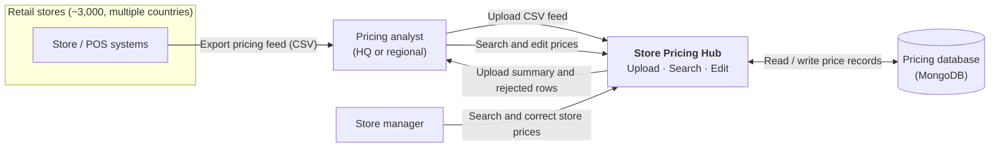

# 1. Context Diagram

**Store Pricing Hub** lets a retail chain of about 3,000 stores in several countries load store pricing feeds, then find and correct individual prices.

## Actors and external systems

| Actor / system | Interaction with Store Pricing Hub |
|---|---|
| **Store / POS systems** | Produce pricing feeds as CSV files with Store ID, SKU, Product Name, Price and Date. They do not call the system directly; a user uploads the file. |
| **Pricing analyst** | Uploads feeds, reviews the upload result (inserted, updated and rejected rows), and searches and edits prices across stores. |
| **Store manager** | Searches prices for their store and corrects individual records. |
| **Pricing database** | Stores price records and upload history. |

## System boundary

**Inside the system:**
- CSV upload and validation
- Persistence of price records
- Search with multiple criteria
- Record editing

**Outside the system (assumed to exist elsewhere):**
- Generating feeds at the stores
- Publishing prices back to POS or e-commerce channels
- Corporate identity provider (see [Assumptions](05-assumptions.md))
