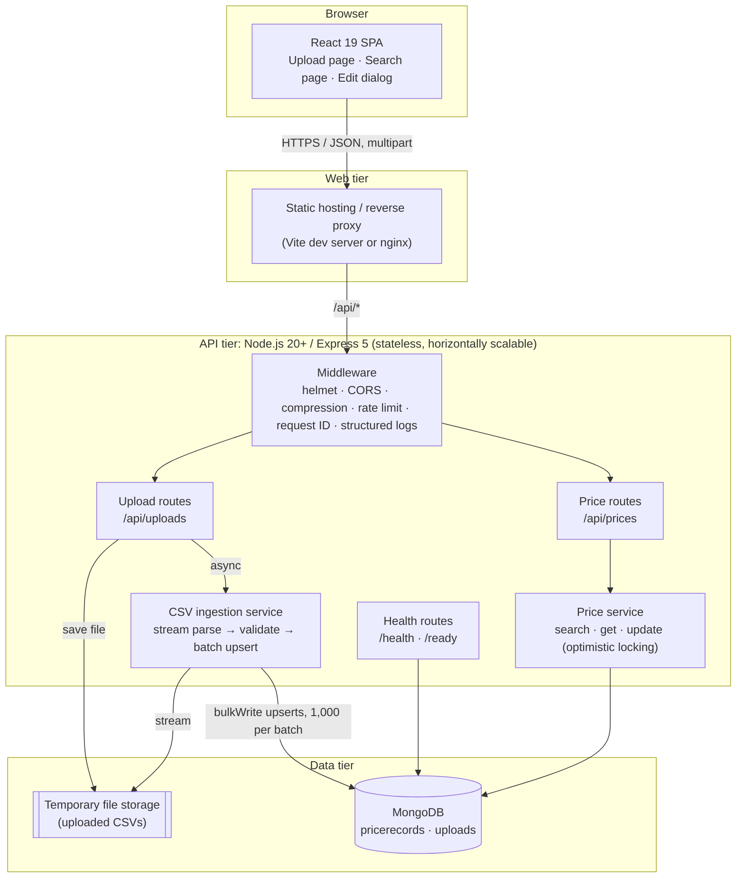
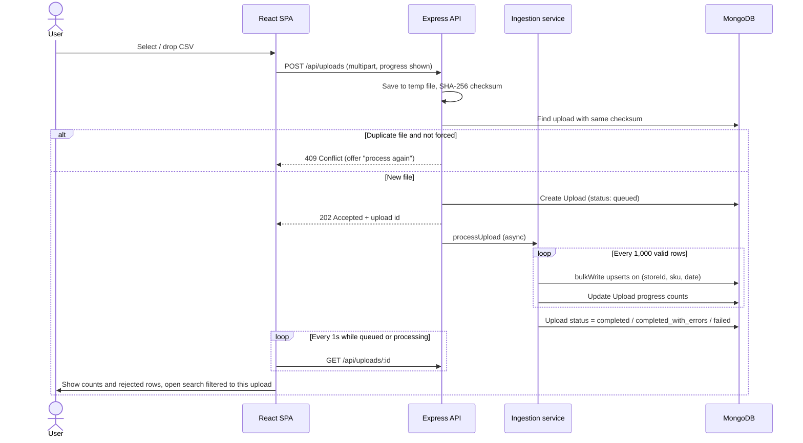
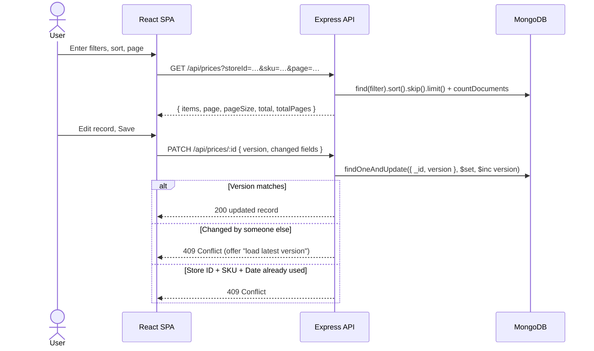
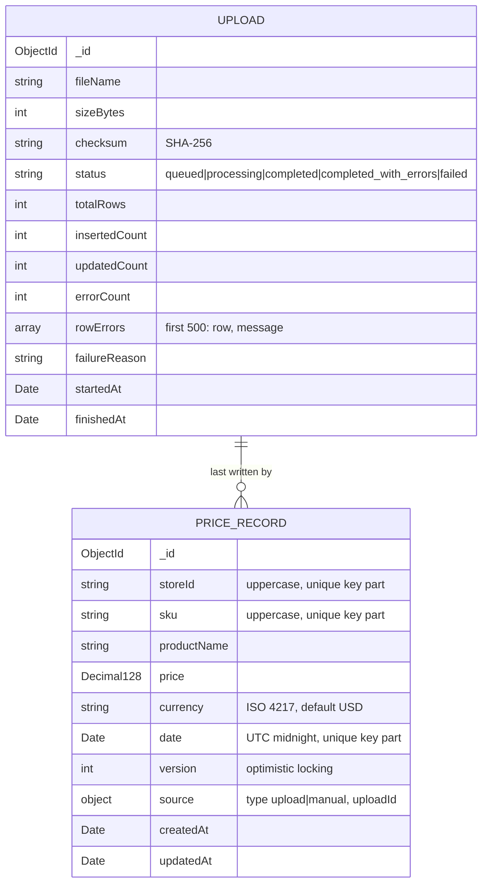
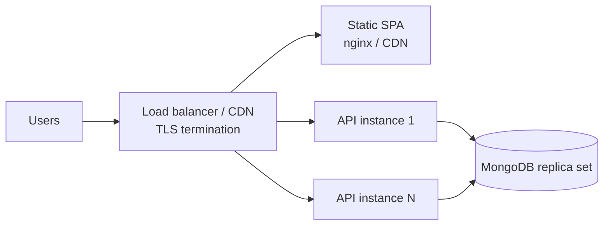

# 2. Solution Architecture

## 2.1 Logical architecture

## 2.2 Components

| Component | Responsibility | Key files |
|---|---|---|
| **React SPA** | Upload page with drag-and-drop and progress; search page with filters, sorting and pagination; edit dialog. Search state is kept in the URL. | `frontend/src/pages`, `frontend/src/components` |
| **API client** | Fetch wrapper with consistent error handling; XHR upload so progress can be shown. | `frontend/src/api.js` |
| **Express app** | HTTP middleware, routing and centralised error handling. | `backend/src/app.js`, `middleware/` |
| **Upload routes** | Accept the CSV (multipart), compute a SHA-256 checksum, reject duplicate files, create an `Upload` record, start ingestion and return `202 Accepted`. | `backend/src/routes/uploads.js` |
| **CSV ingestion service** | Streams the file, maps header variants, validates each row, removes duplicate keys within a batch, and upserts in batches. It records progress and rejected rows on the `Upload` record. | `backend/src/services/csvIngest.js` |
| **Price routes and service** | Validate search and edit requests (zod), build indexed queries, paginate, and apply edits with optimistic concurrency. | `backend/src/routes/prices.js`, `services/priceService.js` |
| **MongoDB** | `pricerecords` (one document per store, SKU and date) and `uploads` (upload status and results). | `backend/src/models` |

## 2.3 Key flows

### Upload a pricing feed

### Search and edit a price

## 2.4 API

| Method | Path | Purpose |
|---|---|---|
| `POST` | `/api/uploads[?force=true]` | Upload a CSV feed. Returns `202` with the upload record. |
| `GET` | `/api/uploads` | List uploads (paginated). |
| `GET` | `/api/uploads/:id` | Upload status, counts and rejected rows. |
| `GET` | `/api/prices` | Search. Filters: `storeId` (comma-separated list), `sku` (prefix), `productName` (contains), `currency`, `dateFrom`, `dateTo`, `priceMin`, `priceMax`, `uploadId`. Also `sortBy`, `sortDir`, `page`, `pageSize`. |
| `GET` | `/api/prices/:id` | Get one record. |
| `PATCH` | `/api/prices/:id` | Edit a record. The body includes `version` plus the changed fields. |
| `GET` | `/health`, `/ready` | Liveness and readiness (database connected). |

## 2.5 Data model

**Indexes on `pricerecords`:**

| Index | Serves |
|---|---|
| `{ storeId, sku, date }` (unique) | Natural key and upserts; store-level searches |
| `{ sku, date }` | One SKU across all stores |
| `{ date, storeId }` | Date-range searches and the default sort |
| `{ source.uploadId }` | "Records from this upload" view |

## 2.6 Deployment view

**Prototype:**
- The API runs as a single Node.js process. The backend `Dockerfile` builds it.
- `npm run dev:memory` starts it with an in-memory MongoDB for local review.
- The SPA is served by Vite in development, or as static files behind nginx (`frontend/nginx.conf`).

**Production target:**
- Multiple stateless API instances behind a load balancer.
- A MongoDB replica set.
- The SPA served from a CDN.
- Production evolution is described in [Non-Functional Requirements](04-non-functional-requirements.md).
