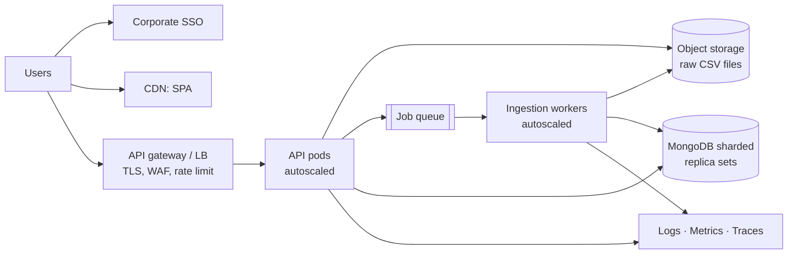

# 4. Non-Functional Requirements

The brief asks for the standard NFRs of a retail chain with **about 3,000 stores in several countries**. Each NFR below shows how the prototype addresses it and what changes for production. ✅ means implemented in the prototype; ➡️ means planned for production.

## 4.1 Expected load (sizing basis)

| Measure | Estimate |
|---|---|
| Stores | ~3,000 |
| Active SKUs per store | ~10,000–20,000 |
| Full price snapshot | ~30–60 million store × SKU price points |
| Daily feeds | ~3,000 store feeds a day (one per store), or a few large regional feeds |
| Typical feed size | 1k–100k rows (5–20 MB) |
| Concurrent users | Hundreds (HQ and regional pricing teams, store managers) |
| Price history | Grows with every price change and is kept for audit |

## 4.2 NFRs and how the design addresses them

### Scalability

- ✅ Stateless API, so instances can be added behind a load balancer (D23).
- ✅ Streaming CSV parse; memory use does not grow with file size (D11).
- ✅ Batched, unordered bulk upserts (D12).
- ✅ Compound indexes that match the query patterns (D18).
- ✅ Page size capped at 200; Store ID list capped at 500 per search.
- ➡️ Move ingestion to a **queue and worker pool** (e.g. SQS or RabbitMQ) so uploads scale separately from the API.
- ➡️ **Shard MongoDB** by `storeId` or region.
- ➡️ Store raw files in object storage (S3 or Azure Blob) instead of local temp storage.

### Performance

- ✅ Searches by store, SKU and date use indexes.
- ✅ Upload returns `202` immediately and processing runs in the background.
- ✅ HTTP compression.
- ✅ Batch size is configurable (`INGEST_BATCH_SIZE`).
- ✅ Connection pool of 50.
- **Targets:**
  - Search p95 under 500 ms for indexed filters.
  - 100k-row feed processed in under 1 minute.
- ➡️ Full-text or search index for product names (D19).
- ➡️ Cursor-based pagination and capped or approximate counts for very large result sets (D20).
- ➡️ CDN for static assets.

### Availability and reliability

- ✅ `/health` (liveness) and `/ready` (database check) for load balancers and orchestrators.
- ✅ Graceful shutdown on SIGTERM.
- ✅ Each upload's status is persisted, so failures are visible rather than lost.
- ✅ Unordered writes isolate failures to the affected rows.
- **Targets:**
  - 99.9% availability.
  - RPO ≤ 15 minutes; RTO ≤ 1 hour.
- ➡️ MongoDB replica set with automated backups and point-in-time recovery.
- ➡️ API instances spread across availability zones.
- ➡️ Workers retry failed uploads with a dead-letter queue.
- ➡️ Recover uploads interrupted by a restart (resume or re-queue jobs left in `processing`).

### Data integrity and consistency

- ✅ Unique key on Store ID + SKU + Date (D5).
- ✅ Re-uploads are idempotent upserts.
- ✅ Duplicate files are blocked (D15).
- ✅ Prices stored as Decimal128 (D6).
- ✅ Strict validation of rows and edits; unknown fields are rejected (D13).
- ✅ Optimistic locking prevents lost updates (D9).
- ✅ Edits that would collide with another record's key are rejected.
- ✅ Each record stores its source (upload ID or manual edit) and `updatedAt`.
- ➡️ Full **audit history** of price changes: who changed what, and when.
- ➡️ Approval workflow for large manual price changes.

### Security

- ✅ helmet security headers.
- ✅ CORS allow-list.
- ✅ Rate limiting (300 requests per minute per IP).
- ✅ JSON body limit of 100 kB; upload limit of 50 MB; only `.csv` files accepted.
- ✅ Validated, typed query parameters and escaped regex input (blocks NoSQL injection and ReDoS).
- ✅ Errors don't expose internal details.
- ✅ The backend container runs as a non-root user.
- ➡️ **SSO (OIDC or SAML)** against the corporate identity provider.
- ➡️ **Role-based access:** HQ sees all stores; regional users see their region; store managers see their own store.
- ➡️ TLS everywhere; encryption at rest; secrets in a vault.
- ➡️ Malware scanning of uploaded files.

### Internationalisation (multiple countries)

- ✅ Currency stored with every price (ISO 4217).
- ✅ Prices are formatted in the user's locale (`Intl.NumberFormat`).
- ✅ Dates stored as UTC calendar dates in ISO `YYYY-MM-DD`, so there is no time-zone drift.
- ✅ CSV byte-order marks are handled; UTF-8 product names are supported.
- ➡️ Translated UI text.
- ➡️ Per-country tax-inclusive or tax-exclusive price rules.
- ➡️ **Data residency:** regional deployments where local regulations require it.

### Observability

- ✅ Structured JSON logs (pino).
- ✅ Every request has an `X-Request-Id`, which also appears in error responses.
- ✅ Upload results are logged.
- ✅ Each upload keeps its row-level error report (first 500 errors).
- ➡️ Metrics (feed throughput, error rate, search latency) and dashboards.
- ➡️ Distributed tracing (OpenTelemetry).
- ➡️ Alerts on failed uploads or stores that haven't sent a feed.

### Usability

- ✅ Drag-and-drop upload with a progress bar.
- ✅ Clear counts of inserted, updated and rejected rows, with line-level reasons.
- ✅ After an upload, the search opens showing that upload's records.
- ✅ Sortable, paginated results.
- ✅ Searches can be bookmarked or shared via the URL.
- ✅ Inline field validation in the edit dialog.
- ✅ Keyboard support (Esc closes the dialog; the drop zone opens with Enter).
- ✅ Responsive layout.
- ➡️ Downloadable rejected-rows file.
- ➡️ Bulk edit.
- ➡️ Full WCAG 2.1 AA accessibility audit.

### Maintainability and testability

- ✅ Layered code: routes, services and models, with middleware and utilities separate.
- ✅ Configuration in environment variables.
- ✅ Automated tests (`node --test` with an in-memory MongoDB):
  - row validation
  - upload and ingestion
  - duplicate files
  - search filters and sorting
  - optimistic locking
  - key collisions
  - invalid input
- ➡️ CI pipeline with lint, tests and a security scan.
- ➡️ Database migrations for index management.
- ➡️ OpenAPI specification.

### Portability and deployability

- ✅ Backend `Dockerfile` (Node 22 Alpine, production dependencies only, health check).
- ✅ nginx configuration for serving the SPA and proxying the API.
- ✅ `npm run dev:memory` runs the backend without installing MongoDB.
- ➡️ Infrastructure as code (Terraform).
- ➡️ Container orchestration (Kubernetes or ECS) with autoscaling.
- ➡️ Blue/green or rolling deployments.

## 4.3 Target production architecture

